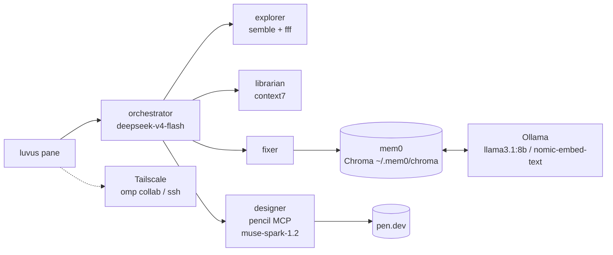

My agentic setup now costs $10 and survives lid-close, same job, no VPS. Here is the cheap local stack that replaced it.

> **TL;DR:** luvus.dev for sessions, OpenCode Go with DeepSeek V4 Flash as primary model, omp as harness guardrails, mem0 + Ollama + Chroma for local memory, and pen.dev via pencil MCP for design. One prompt to start the day: “check my tasks in GitLab and GitHub.”

Update to my [last workflow post](/posts/how-i-set-up-my-daily-workflow-with-ai/), same philosophy, way less friction. Still cheap, and it still runs from my phone at the warung.

Here is the stack I actually use every day, how it is wired, and how I use it.

> Shameless plug: if you want to try OpenCode Go, use my ref: [opencode.ai/go?ref=FEC512FJZB](https://opencode.ai/go?ref=FEC512FJZB). Helps me keep that $10/mo sub running. You get the same cheap models I use below.

## The stack: luvus, OpenCode Go, omp, mem0, and pen.dev

- **[luvus.dev](https://luvus.dev)**: terminal multiplexer for agents. My workspace, not a terminal. Panes, agents, sessions that survive disconnects.
- **[OpenCode Go](https://opencode.ai/go?ref=FEC512FJZB)**: the harness that runs the agents. One config, many agents, all on cheap models.
- **[omp (oh-my-pi)](https://github.com/mandaputtra/oh-my-pi)**: the harness glue on this blog's repo. Load-bearing changes, safe defaults.
- **Local memory via [mem0](https://mem0.ai) + Ollama**: owns my context. No cloud lock-in.
- **[pen.dev](https://pen.dev)**: design, then hand it to agents via MCP.
Total cost: $10/mo for OpenCode Go. My old $6 VPS got cut from the workflow, now it is only for project deployments. No more paying to keep a dev server warm. Everything runs local, cheaper than my old smoking budget, and the budget is actually dead this time.

## Models: DeepSeek V4 Flash for everything

I finally stopped model-hopping.

Primary for **everything**: orchestrator, explore, fix, librarian:

```txt
opencode-go/deepseek-v4-flash
```

It's in my `opencode.json` as both `model` and `small_model`. Flash is fast, cheap, and doesn't burn through the $10 credit. I can't even finish the quota.

When I need it, I switch:

- **DeepSeek V4 Pro / MiniMax M3**: harder reasoning, image/doc understanding. I have `image-reader` and `document-reader` agents on `minimax-m3` for screenshots/PDFs.
- **Muse Spark 1.2**: design passes (more tasteful frontend output).
- **Mimo V2.5**: `council` agent when I want a second opinion.

Rule: Flash by default, escalate only when Flash says "I need help": which is rare.

## Agents: small team, clear jobs

From `oh-my-opencode-slim` (deepseek preset), tweaked:

| Agent | What it does | Model |
|-------|--------------|-------|
| **orchestrator** | Plans, delegates, owns the task | deepseek-v4-flash (high) |
| **explorer** | Finds code: uses `fff` + `semble` | deepseek-v4-flash |
| **librarian** | Reads docs: `context7` + `websearch` | deepseek-v4-flash |
| **oracle** | Simplifies/trims after a change | deepseek-v4-flash |
| **fixer** | One-job bugfix | deepseek-v4-flash |
| **council** | Second opinion / grill the plan | mimo-v2.5 |
| **designer** | Frontend taste + pen.dev assets | muse-spark-1.2 |
| **image-reader / document-reader** | Vision + PDF | minimax-m3 |

I scoped MCP per agent. Orchestrator gets `fff` + `semble` but **not** `context7`, librarian owns docs. Keeps context small and each agent cheaper.

I use `explorer` the most. Ask "where is auth middleware?": it uses `semble` to jump straight to file:line instead of grep roulette.

## omp: the guardrails

`omp` is the harness inside this repo (`AGENTS.md`). It enforces:

- correctness first, then maintainability
- no needless abstractions (boring > clever)
- clean cutover: every caller migrated, no shims left behind
- verification before yield (run the app, not tests)

It's why I can let agents touch `AGENTS.md` repos and not wake up to a `rm -rf` at 3am. Non-root user, blocked destructive commands, hook-level blocks.

## Skills I actually use daily

I installed ~15 skills. Three pay rent every day:

### 1. ponytail: the lazy senior

Ladder: does it need to exist? already in codebase? stdlib? native platform? installed dep? one-liner?

It deletes more code than it writes. Perfect for my taste. Every post-edit I expect:

> skipped: custom cache class, add when `lru_cache` measurably falls short.

It also marks corners with `ponytail: global lock, per-account locks if throughput matters` so I know where the ceiling is.

### 2. caveman: terse by default

Technical substance stays, fluff dies. Articles, hedges, pleasantries gone. Fragments OK.

```txt
Bug in auth middleware. Fix: guard nil token. Check: /auth:42.
```

Saves ~60% context per subagent via `cavecrew` (investigator/builder/reviewer). Across 20 delegations that's the difference between finishing and context exhaustion.

Toggle: `/caveman lite|full|ultra`: I live on `full`. Code/commits stay normal prose.

### 3. call-graph: X → Graph → Effect

When I ask "how does X work?" it doesn't guess. It draws:

```txt
X → Graph → Effect<A,E,R>
```

Then annotates every node with `A` (what flows), `E` (where it breaks: retry/escape/die), `R` (what it needs), plus `path:line` evidence. `codegraph_explore` + LSP, not grep.

Two more I use weekly: `luvus` (control panes), `worktrees` (one-line issues get a worktree automatically).

## How you access it: phone, laptop, anywhere

No VPS in the loop anymore. Budget cut: the VPS is for deployments now, not for dev. Everything runs on my MacBook, you reach it via Tailscale.

Two paths, both via Tailscale (never exposed publicly):

1. **omp collab**: browser relay. I open the project on my laptop, agents run there, I collab from phone. Tap to approve, diff viewer on phone is decent.
2. **ssh via Tailscale**: `ssh mbp` → `luvus session attach default`. Panes survive. I can start a task on laptop, detach, check from phone on the bus.

luvus sessions (all local, no VPS):

```txt
default        running   ~/.luvus              # daily driver
job_searching  running   ~/.luvus/sessions/job_searching
```

Detaching doesn't kill agents: they keep grinding. That's the whole "work from the dentist's chair" bit from the last post, but actually reliable now. And without a VPS to babysit, there's nothing to update, patch, or pay for when idle.

## Memory: why owning context beats bigger models

Hot take: **owning your context and memory is the best thing you can do right now**. With it, cheap models beat expensive ones.

I run [mem0](https://mem0.ai) locally:

- **LLM:** `ollama/llama3.1:8b` for extraction
- **Embedder:** `ollama/nomic-embed-text`
- **Vector store:** ChromaDB at `~/.mem0/chroma` (collection `omp_memory`)

Config in `~/.local/share/mcp-mem0/server.py`:

```python
config = {
  "llm": {"provider": "ollama", "config": {"model": "llama3.1:8b"}},
  "embedder": {"provider": "ollama", "config": {"model": "nomic-embed-text"}},
  "vector_store": {"provider": "chroma", "config": {"path": "~/.mem0/chroma"}},
}
```

Exposed as MCP `local-memory` with two tools: `store_memory` and `search_memory`. Any agent can call `search_memory("tailscale setup")` and get my past decisions back: no re-explaining.

Yesterday it returned:

```txt
- Prefers terse, evidence-first answers
- Works on project_a monorepo ~/Code/project_a
- Uses omp on macOS
```

All local. No API key, no retention policy to read. And because memory does the heavy lifting, Flash ($10/mo) practically builds anything. Expensive models are a tax for not having memory.

If `local-memory` shows `✗ failed` in `opencode mcp list`, it's always Ollama not running: `ollama serve` fixes it. `brew services start ollama` to persist.

## pen.dev: design without Figma ping-pong

I design in [pen.dev](https://pen.dev), then connect it via MCP `pencil`:

```json
"pencil": {
  "command": ["/Applications/Pen.app/Contents/Resources/app.asar.unpacked/out/mcp-server-darwin-arm64", "--app", "desktop", "--agent", "openCodeCLI"]
}
```

Flow:

1. Mock the section in pen.dev (one image per section: never a board of 8 sections crammed into one).
2. Agent `designer` (muse-spark) pulls the asset via `pencil` MCP.
3. It implements to match the image pixel-for-pixel: no re-interpretation.

No more "here's a screenshot, rebuild it" loops. The image *is* the spec. I use it for landing sections, premium mockups, identity boards: `design-taste-frontend` skill enforces the anti-slop rules (composition variety, editorial typography, gapless bento).

## A day in the life: from GitLab check to ship

**08:00**: Open omp. One prompt: “check my tasks in GitLab and GitHub”. Orchestrator pulls assigned issues (read-only tokens), ranks by priority/complexity, you pick the easy one first on your phone.

**08:05**: On laptop: `luvus pane create` → "fix avatar upload race condition". Orchestrator spawns `explorer` (finds handler via `semble`), `fixer` patches, `oracle` trims. I review diff in Neovim.

**09:30**: Designer task: mock pricing section in pen.dev → tell designer agent "implement pen file pricing-03" → it pulls via `pencil` MCP, ships.

**12:00**: Bus ride. Phone: `omp collab`: check running session `job_searching`, approve council's grilled plan.

**15:00**: Need context from 2 months ago: agent calls `search_memory("ffmpeg compression")` → gets my past decision, no re-prompting.

**18:00**: `store_memory("Prefers Dvorak, deploys via Netlify to _site/")`: so tomorrow Flash doesn't ask again.

No magic: small agents, cheap models, owned memory, and a multiplexer that survives lid-close.

## What I tried that did not work

Before omp, I ran a $6 VPS with `paseo schedule` to rank GitLab/GitHub issues overnight. It worked, but I paid to keep a dev server warm and waited for cron to finish. Moving ranking into a single omp prompt (“check my tasks in GitLab and GitHub”) cut the VPS out of the loop. VPS now only deploys projects, it no longer blocks my morning.

## Known limitations

- Ollama must be running (`ollama serve` or `brew services start ollama`), otherwise `local-memory` shows `✗ failed` in `opencode mcp list`
- `search_memory` recall is noisy around 0.6 score: you still need to confirm with `codegraph_explore`
- pen.dev `pencil` MCP needs Pen desktop running locally

## What is an agentic workflow?

An agentic workflow is not chat-then-paste. It is a team of scoped agents (planner, explorer, librarian, fixer) that share memory and tools, each owning one job and passing context via `semble`, `fff`, and `codegraph_explore`. The orchestrator plans, delegates, and verifies: you review the diff. The win is not speed alone, it is that cheap models with owned context do the heavy lifting.

## How the pieces connect



## FAQ

**How does local mem0 compare to cloud memory?**
Local is zero retention policy, zero latency, and cheap models reuse context. Cloud is convenient but you rent back your own decisions.

**What if DeepSeek V4 Flash is not enough?**
Escalate: MiniMax M3 for image/doc, DeepSeek V4 Pro for hard reasoning, Mimo V2.5 for council second opinion. Flash stays primary because memory does the heavy lifting.

Stack again for copy-paste:
